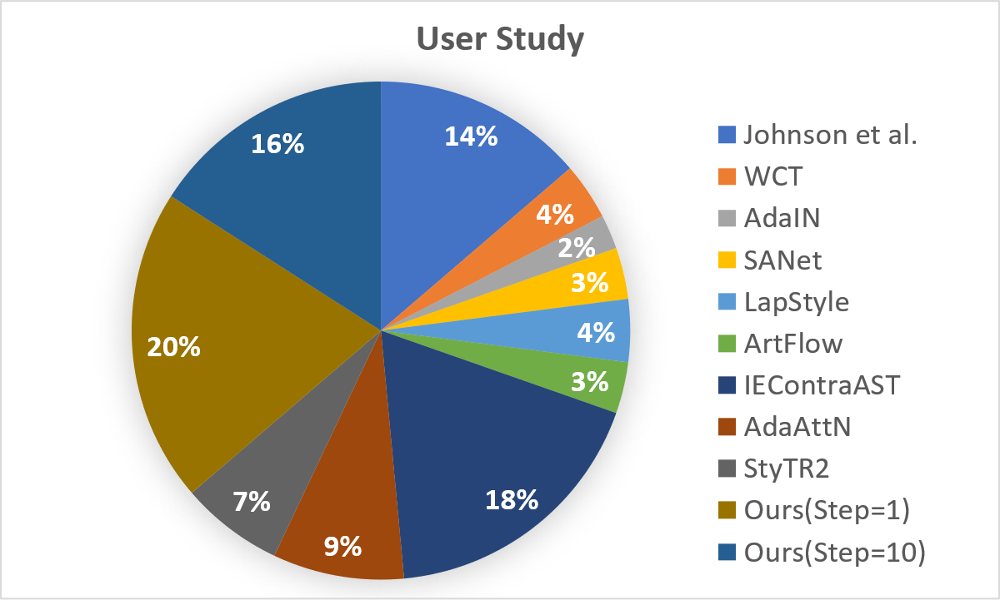

# This is our supplementary material for aaai

# User Study

# Style Interpolation
We try to put the feature maps obtained by weighting the encoded features from different styles of Encoder with different proportions into different styles of Decoder, and the result is shown as follows, where "1:0" indicates that the feature map weight of style A is 1 and the feature map weight of style B is 0. "0:1" means the feature map weight of style A is 0, and the feature map weight of style B is 1.

# More Steps

